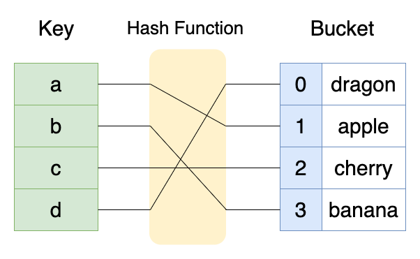

# 13주차 이론

## 해시(Hash)

해시는 **해시 함수를 사용해서 변환한 값을 인덱스로 삼아 키와 값을 저장**해서 빠른 데이터 탐색을 제공하는 자료구조. 해시는 key를 활용해 데이터 탐색을 빠르게 한다. 

### 해시의 특징

해시는 **단방향으로 동작**한다. 키를 통해 값을 찾을 수 있지만 값을 통해 키를 찾을 수는 없다.

O(1)만에 찾고자 하는 값을 바로 찾을 수 있다. 키 자체가 해시함수에 의해 값이 있는 인덱스가 되므로 **값을 찾기 위한 탐색 과정이 필요 없다**.

값을 인덱스로 활용하기 위해 적절한 변환 과정을 거쳐야 한다.

***해시를 사용하지 않는다면?***

어떤 데이터를 찾으려면 전체 데이터를 확인해보는 방법밖에는 없다. 순차 탐색을 통해 원하는 위치를 찾아서 해당 위치의 정보를 읽어와야한다. 그러나 해시를 사용하면 **해시 함수를 활용해서 특정 값이 있는 위치를 바로 찾을 수 있어서** 탐색 효율이 좋다. 

해시 테이블(hash table) : 키와 대응하는 값이 저장되어 있는 공간

버킷(bucket) : 해시 테이블의 각 데이터

### 해시의 특성 활용

데이터를 저장하고 검색하거나, 보안이 필요한 때에 활용

비밀번호 관리 : 해시함수를 이용해 해싱한 비밀번호를 저장. 

데이터베이스 인덱싱 : 데이터베이스에 저장된 데이터를 효율적으로 검색할 때 해시를 활용

블록체인 : 각 블록은 이전 블록의 해시값을 포함하고 있으며 이를 통해 데이터 무결성을 확인

## 해시함수

자바스크립트에서는 오브젝트라는 자료형을 제공하는데 이 자료형은 해시와 거의 동일하게 동작하므로 해시를 쉽게 사용할 수 있다. 

### 해시 함수를 구현할 때 고려할 내용

- 해시 함수가 변환한 값은 인덱스로 활용해야 하므로 해시 테이블의 크기를 넘으면 안된다. 만약 크기가 N 인 해시 테이블이 있다면 해시 함수의 결과는 0 ~ N-1 사이의 값을 내야한다.
- 해시 함수가 변환한 값의 충돌은 최대한 적게 발생해야 한다. 서로 다른 두 키에 대해 해싱 함수를 적용한 결과가 동일한 경우가 충돌이라고 한다.

### 자주 사용하는 해시 함수 알아보기

### **나눗셈법**

키를 소수로 나눈 나머지를 활용하는 방법. x는 키, k는 소수

$$
h(x) = x \bmod k
$$

 

나눗셈법에서 소수가 아닌 수를 이용하게 되면 소수를 이용할때보다 충돌이 많아지기 때문에 약수가 없는 소수를 사용하는 것이 좋다. 

이 해시 함수의 해시테이블 크기는 자연스럽게 k가 된다. 왜냐면 k에 대한 모듈러 연산을 했을 때 나올 수 있는 값은 0 ~ (k-1)이기 때문이다. 그래서 큰 크키의 해시테이블이 필요하다면 아주 큰 소수가 필요하게 된다. 현재로서 매우 큰 소수를 구하는 효율적인 방법은 없으므로 이것이 나눗셈범의 단점이 된다. 

### 곱셈법

곱셈법은 나눗셈법과 비슷하게 모듈러 연산을 활용하지만 소수는 활용하지 않는다. 

$$
h(x) = ((x \times A) \bmod 1) \times m
$$

m은 최대 버킷의 개수, A는 황금비이다. (*황금비는 무한소수로 대략 1.6180339887…)

키에 항금비를 곱하고 그 값에 모듈러 1를 취한다. 즉, 소수 부분만 취한다. 

여기서 최대 버킷 갯수인 m을 곱하면 테이블 인덱스인 0 ~ (m-1)에 매치할 수 있다. 

이 해시 함수는 황금비를 사용하므로 나눗셈법처럼 소수가 필요 없다. 따라서 해시 테이블의 크기가 커져도 추가 작업이 필요가 없어진다.

### 문자열 해싱

문자열 해싱 방법은 키의 자료형이 문자열일 때도 사용할 수 있다. 문자열의 문자를 숫자로 변환하고 이 숫자들을 다항식의 값으로 변환해서 해싱한다.

$$
 \quad h(s) = (s_0 p^0 + s_1 p^1 + \cdots + s_{n-1} p^{n-1}) \bmod m
$$

p는 31이고 m은 해시 테이블 최대 크기이다. (31: 홀수이면서 메르센 소수)

<aside>
💡

메르센 소수는 일반적으로 $2^n - 1$ 형식으로 표시할 수 있는 숫자 중 소수인 수를 말한다. 메르센 소수는 해시에서 충돌을 줄이는데 효과적이라는 연구 결과가 있다. 

</aside>

## 충돌 처리

### 체이닝으로 처리

체이닝은 충돌이 발생하면 해당 버킷에 연결 리스트로 같은 해시값을 가지는 데이터를 연결한다. 즉, 같은 키에 연결 리스트를 이용해 여러 값을 이어 붙이는 방벙이다. 

단점

1. 해시테이블 공간 활용성이 떨어짐 : 충돌이 많아지면 연결 리스트의 길이가 길어지고 다른 해시 테이블의 공간은 덜 사용하므로 공간 활용성이 떨어진다.
2. 검색 성능이 떨어짐 : 연결 리스트 자체의 한계 때문에 검색 성능이 떨어진다. 연결 리스트로 연결한 값을 찾으려면 연결 리스트 맨 앞 데이터부터 검색을 해야한다. 최악의 경우 시간 복잡도는 O(N)이다.

## 개방 주소법으로 처리

개방 주소법은 빈 버킷을 찾아 충돌값을 삽입하는 방식이다. 해시 테이블을 최대한 활용하므로 체이닝보다 메모리를 더 효율적으로 사용한다.

**선형 탐사 방식**

충돌이 발생하면 다른 빈 버킷을 찾을 때까지 일정한 간격으로 이동한다. 이 경우 충돌 발생 시 일정한 간격으로 이동하며 해시 테이블 빈 곳에 값을 넣으면 해시 충돌이 발생한 값끼리 모이는 영역이 발생한다. 이를 클러스터를 형성한다고 하는데 이런 부분이 발생하면 해시값은 겹칠 확률이 올라간다. 

**이중 해싱 방식**

이중 해싱 방식은 해시 함수를 2개 사용하는 방식이다. 두 번째 해시 함수의 역할은 첫 번째 해시 함수로 충돌이 발생하면 해당 위치를 기준으로 어떻게 위치를 정할지 결정하는 역할이다. 이 방식은 선형 탐사 방식보다 클러스터를 최대한 피하는 방식이다.