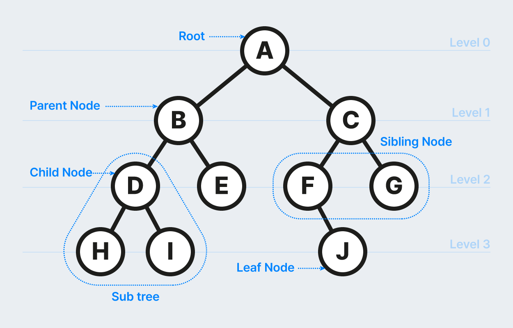

# 12주차 이론

## 트리(tree)

트리는 데이터를 저장하고 탐색하기에 유용한 구조를 가지고 있다. 나무 기둥에서 가지가 뻗어나가는 모습을 거꾸로 뒤집어 놓은 모양으로 나무의 root가 맨 위에 존재한다. 

node : 트리를 구성하는 요소

root : 가장 최상위 노드

edge(간선) : 노드와 노드 사이를 연결하는 선

level : 루트 노드로부터 특정 노드까지 가는 최소한의 간선 수

parent node(부모 노드) : 간선으로 직접 연결된 노드 중 위에 있는 노드

child node(자식 노드) : 간선으로 직접 연결된 노드 중 아래에 있는 노드

sibling node(형제 노드) : 같은 부모 노드를 가지는 노드

leaf node(말단 노드) : 자식이 없는 노드

degree(차수) : 특정 노드에서 아래로 향하는 간선의 개수

### 이진트리(binary tree)

모든 노드의 최대 차수가 2를 넘지 않는 트리

### 배열로 이진트리 표현하기

배열은 선형 구조, 트리는 계츠 구조이므로 배열로 트리를 표현하기 위해서 3가지 규칙이 필요하다.

- **루트 노드**는 배열 **인덱스 1번**에 저장
- 왼쪽 자식 노드의 배열 인덱스는 **부모 노드의 배열 인덱스 * 2**
- 오른쪽 자식 노드의 배열 인덱스는 **부모 노드의 배열 인덱스 * 2 + 1**

(루트 노드의 인덱스가 0인 경우는 왼쪽 자식 노드는 부모 노드의 배열 인덱스 * 2 +1, 오른쪽 자식 노드는 부모 노드의 배열 인덱스 * 2 +2)

배열로 이진트리를 구성하면 실제 노드 개수보다 많은 공간을 사용할 수 밖에 없다. 그러나 구현 난이도가 쉽기에 메모리만 넉넉하다면 구현 시간을 단축할 수 있다. 

### 포인터로 이진트리 표현하기

포인터로 트리를 표현하기 위해서는 노드부터 정의해야한다. 

| 왼쪽 자식 노드 포인터 | 값 | 오른쪽 자식 노드 포인터 |
| --- | --- | --- |

이렇게 값의 양 옆에 자식 노드의 포인터를 두어 실제 계층 구조로 트리를 표현할 수 있다. 배열과 달리 인덱스 연산을 하지 않으므로 메모리 공간을 낭비하지 않는다. 실제 노드를 따라가도록 구현해야 하므로 구현 난이도는 트리에 비해 조금 높다. 

## 이진트리 순회

순회란 어떤 데이터가 있을 때 그 데이터를 빠짐 없이 방문하는 것을 의미한다. 

- **전위 순회(preorder)** : 부모 노드 → 왼쪽 자식 노드 → 오른쪽 자식 노드
- **중위 순회(inorder)** : 왼쪽 자식 노드 → 부모 노드 → 오른쪽 자식 노드
- **후위 순회(postorder)** : 왼쪽 자식 노드 → 오른쪽 자식 노드 → 부모 노드

### 전위 순회

6 → 4 → 2 → 1 → 3 → 5 → 8 → 7 → 9

트리를 복사할 때 많이 사용한다.

### 중위 순회

1 → 2 → 3 → 4 → 5 → 1 → 7 → 8→ 9

이진 탐색 트리에서 정렬된 순서대로 값을 가져올 때 자주 사용한다. 

### 후위 순회

1 → 3 → 2 → 5→ 4 → 7 → 9 → 8 → 6

부모 노드를 먼저 삭제하면 안되기 때문에 트리를 삭제할 때 자주 사용한다. 

## 이진 트리 탐색하기

### 이진 탐색 트리 구축하기

이진 탐색 트리는 데이터 크기를 따져 현재 노드보다 값이 작으면 왼쪽 자식 위치에, 크거나 같으면 오른쪽 자식 위치에 배치한다. 데이터를 하나씩 삽입하면서 동시에 정렬를 진행하다. 

예시의 경우 ) 6 → 8 → 7→ 9 → 4 → 5 → 2 → 3 → 1  

### 이진 탐색 트리 탐색하기

1. 찾으려는 값이 현재 노드의 값과 같으면 탐색을 종료하고 크면 오른쪽 노드를 탐색
2. 찾으려는 값이 현재 노드의 값보다 작으면 왼 쪽 노드를 탐색
3. 값을 찾으면 종료. 노드가 없을 때까지 계속 탐색했는데 값이 없으면 현재 트리에 값이 없음.

배열 탐색과 비교하여 이진 탐색 트리가 훨씬 빠르고 효율적이다. 이런 이진 탐색 트리의 시간 복잡도는 트리 균형에 의존한다. 트리의 균형은 각 노드의 차수가 비슷하게 유지되면서 각 노드의 자식 노드 수가 비슷하게 유지되는 것을 말한다. **균형이 유지되었다고 가정했을 때 삽입과 탐색 연산 시 이진 탐색 트리에 저장된 노드가 N개라고 하면 시간 복잡도는 O(log N)**이다. 그러나 균형이 맞지 않을 때는 배열과 비슷한다.  치우처진 형태의 트리가 가장 극단적인 경우다.

### 균형 이진 탐색 트리

## 트리의 특성을 활용하는 분야

트리는 계층 구조를 표현하는 용도로 많이 사용한다. 

- 인공지능 : 인공지능의 판단 기준을 만들 때 의사 결정 트리를 사용한다.
- 자동 완성 기능 : 검색 엔진에서 자동 검색어 추천 기능도 트라이 라는 독특한 트리 구조를 활용한다. 이를 활용하면 접두사나 패턴 검색을 쉽게 할 수 있다.
- 데이터베이스 : 데이터를 쉽게 검색, 삽입, 삭제할 수 있도록 트리를 활요한다.