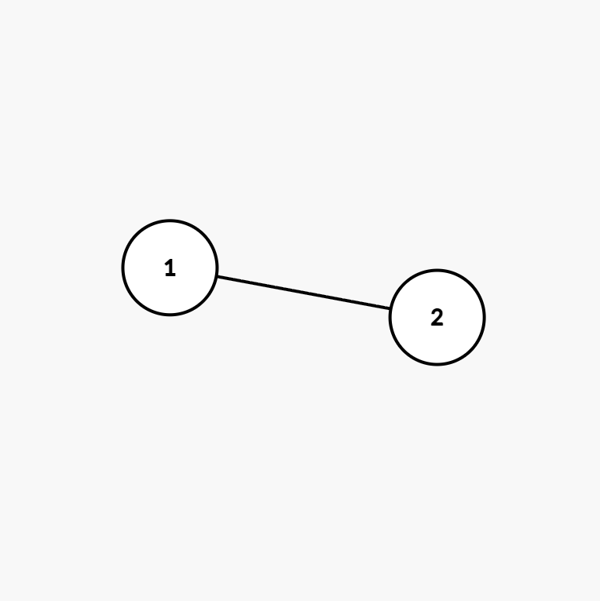

# 12주차 이론

## 그래프

노드와 간선을 이용한 비선형 데이터 구조로 데이터 간의 관계를 표현하는데 사용한다. 데이터를 노드로 노드 간의 관계나 흐름을 간선으로 표현한다. 간선은 방향이 있을 수도 없을 수도 있다. 만약 관계나 흐름에서 정도를 표현할 필요가 있다면 가중치라는 개념을 추가하여 표현한다.

## 그래프의 특징과 종류

그래프는 방향성, 가중치, 순환 특성에 따라 종류를 구분

방향이 있는 간선을 포함하면 방향 그래프, 방향이 없는 간선을 포함하면 무방향 그래프, 데이터의 흐름 뿐 아니라 양도 간선에 표현하면 가중치 그래프

특정 노드에서 시작해 간선을 따라 다시 돌아오는 경로가 있는 경우 순환 그래프라고 하고 순환이 존재하지 않는 그래프를 비순환 그래프라고 한다

### 그래프 구현

그래프 구현 방식에는 인접 행렬과 인접 리스트 방식이 있다

### 인접 행렬(adjacency matrix)

**2차원 배열**을 활용하여 구현하는 경우가 많다. 이때 배열의 인덱스는 노드, 배열의 값은 노드의 가중치로 생각하고, 인덱스의 세로 방향을 출발 노드, 가로 방향을 도착노드로 생각하여 그래프를 표현한다.

|         | 0   | 1   |
| ------- | --- | --- |
| 0(서울) | -   | 400 |
| 1(부산) | -   | -   |

-로 표현한 가중치는 실제 코드에서는 굉장히 큰 값을 넣거나 -1로 정의

### 인접 리스트(adjacency list)

인접 리스트로 그래프를 표현하면 값(v), 가중치(w), 다음 노드(next)를 묶어 관리한다.

1. 우선은 노드 갯수만큼 배열을 준비
2. 배열의 인덱스는 각 시작 노드를 의미하며 배열의 값에는 다음 노드를 연결

|     |     | v   | w   | next |
| --- | --- | --- | --- | ---- |
| 1   |     | 2   | 5   | null |
| 2   |     | 3   | 2   | null |
| 3   |     | 4   | 10  | null |
| 4   |     | 2   | 42  | null |

여기서 만약 노드에서 출발하는 간선이 여러개라면 next에 list를 더 연결한다

### 인접 행렬과 인접 리스트의 장단점

**인접 행렬의 단점**

- 인접 행렬로 희소 그래프를 표현하는 경우
  희소 그래프란 노드 수에 비해 간선 수가 매우 적은 그래프. 인접 행렬은 크기가 고정되어 있으므로 최악의 경우를 고려해서 크기를 결정해야한다. 따라서 노드가 N개 있을 때 모든 간선이 연결되는 최악의 경우를 고려해서 N x N크기의 인접 행렬 공간 중 대부분이 비어 있어 비효율적이게 된다.
- 노드들의 값의 차이가 매우 큰 그래프를 표현하는 경우
  노드값이 순차적으로 증가하지 않고 간격이 크면 가장 큰 노드의 값을 기준으로 행렬의 크기를 잡아야 한다.

**인접 행렬의 장점**

- 간선의 정보를 확인할 때의 시간 복잡도가 O(1)
  인덱스 임의 접근으로 노드 간 간선 정보를 바로 확인할 수 있기 때문에 시간 복잡도가 O(1)
- 구현 난이도가 낮다

**인접 리스트의 단점**

- 간선 정보를 확인할 때는 트겅 노드에서 시작하여 연결된 노드 개수가 많으면 많을 수록 연결한 리스트의 길이만큼 탐색해야하므로 탐색 시간이 O(n)이다

**인접 리스트의 장점**

- 실제 연결된 노드에 대해서만 노드의 값을 담아 연결하면 된다.

⇒ 그래프 문제를 풀 때는 둘 중 더 좋은 것을 선택해야 하지만 보통은 **시간 제약에서 장점을 얻기 위해 인접 행렬** 방식으로 그래프 문제를 주로 풀이.

## 그래프 탐색

그래프에서 경로를 찾는 방법은 크게 2가지가 있다

- 더 이상 탐색할 노드가 없을 때까지 일단 가기. 더 이상 탐색할 노드가 없으면 최근에 방문했던 노드로 되돌아간 다음 가지 않은 노드를 방문**(깊이 우선 탐색)**
- 현재 위치에서 가장 가까운 노드부터 모두 방문하고 다음 노드로 이동. 그 노드에서 또 다시 가장 가까운 노드부터 모두 방문**(너비 우선 탐색)**

### 깊이 우선 탐색

1. 노드 A에서 노드 D까지 차례대로 방문 → 노드 D까지 방문하면 더 이상 방문할 곳이 없다(막힘)

   

2. 노드 D에서 B로 돌아온다. 여기서 다시 끝까지 방문

   

3. 다시 노드 E → B → A 순으로 돌아온다. 그 다음 끝까지 C까지 방문. A → B → D → E → C 순서로 모두 방문함

   

### 너비 우선 탐색

1. 노드 A에서 가장 가까운 노드 B, C를 방문

   

2. 노드 B에서 가장 가까운 노드 D, E를 방문. A → B → C → D → E 순서로 모든 노드 방문.

   

### 문제 풀이용 그래프

