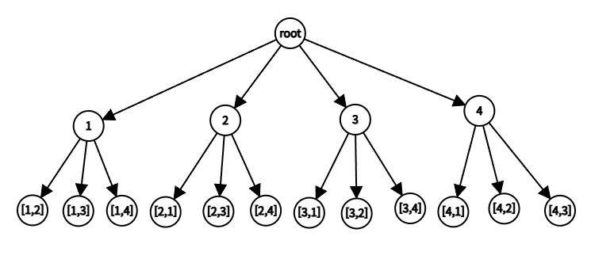
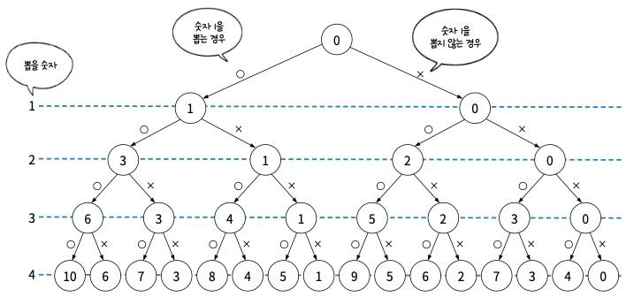

# 17주차 이론

## 백트래킹

**어떤 가능성이 없는 곳을 알아보고 되돌아가는 것을 백트래킹(backtracking)이라** 한다. 백트래킹 알고리즘은 가능성이 있는 곳만 탐색하는 알고리즘으로 답을 찾는 과정에서 **가능성이 없는 곳에서는 백트래킹을 실행**한다. 문제마다 효율이 달라지므로 시간 복잡도를 특정하여 정의하기는 어렵다. 하지만 백트래킹을 통해 해가 될 가능성이 없는 탐색 대상을 배제할 수 있으므로 탐색 효율이 단순히 완전 탐색하는 방법보다 효율적이다.

> 깊이 우선 탐색도 백트래킹을 활용한다. 깊이 우선 탐색에서는 더이상 탐색할 경로가 없을 때 백트래킹을 실행.

## 유망 함수

백트래킹 알고리즘의 핵심은 **해가 될 가능성을 판단하는 것**이다. 그리고 그 가능성은 **유망 함수**라는 것을 정의하여 판단한다.

1. 유효한 해의 집합을 정의
2. 위 단계에서 정의한 집합을 그래프로 표현
3. 유망 함수를 정의
4. 백트래킹 알고리즘을 활용해서 해를 찾는다

유망 함수가 동작하는 예시

### 합이 6을 넘는 경우

{1, 2, 3, 4} 중 2개의 숫자를 뽑아서 합이 6을 초과하는 경우를 알아내는 백트래킹 알고리즘. 여기서 뽑는 순서가 다르면 다른 경우의 수로 간주한다.

1. 유효한 해의 집합 정의

- [1, 2]

- [2, 1]

- [3, 1]

- [4, 1]

- [1, 3]

- [2, 3]

- [3, 2]

- [4, 2]

- [1, 4]

- [2, 4]

- [3, 4]

- [4, 3]

1. 정의한 해의 집합을 그래프로 표현

1. 그래프에서 백트래킹을 수행

   **처음에 뽑은 숫자가 3미만이면 백트래킹한다. 라는 전략을 사용**한다. 즉, 1과 2를 처음에 뽑으면 이후에 어떤 경로로 가도 원하는 답이 나올 수 없으므로 1,2는 아예 탐색을 시도하지 않는다. 이렇게 **특정 조건을 정의하는 것을 유망함수(promising function)를 정의한다고 한다.**

   위의 그래프에서는 1과 2는 유망함수를 통과하지 못하여 백트래킹한다.

2. 3은 유망함수를 통과한다. 3 → 4로 가서야 답을 찾는다.
3. 이와 같은 방식으로 나머지(4)도 탐색을 진행한다.

# 백트래킹 알고리즘 문제에 적용

## 부분 집합 합

부분 집합 합은 1부터 N까지 숫자를 조합했을 때 합이 K가 되는 조합을 찾는 문제이다. 전체 탐색과 백트래킹으로 각각 풀어 차이점을 알아본다.

### 완전 탐색으로 풀기

각 숫자는 뽑는 상태와 뽑지 않은 상태가 있으며, 각 숫자를 선택하는 과정은 다른 숫자에 대한 선택에 영향을 미치지 않는다. N개의 숫자를 뽑는 조합은 2N개가 있으므로, 시간복잡도는 O(2n)이라고 할 수 있다. N = 4, K =5일 때의 경우

노드는 현재까지 뽑은 숫자들의 합을 의미하고 O는 그 수를 뽑는다. X는 그 수를 뽑지 않았다를 의미한다. 완전 탐색의 경우 모든 경우의 수를 탐색하여 총 16번의 탐색을 진행한다.

### 백트래킹으로 풀기

유망 함수를 활용해서 답이 될 가능성이 없는 경우 최대한 탐색이 되지 않도록 한다.

유망 함수 조건 1. 현재 조합으로 합이 K가 되면 더 탐색하지 않기

유망 함수 조건 2. 해당 숫자를 조합하여 합이 K 이상이 되면 더 탐색하지 않기

1. 실제로 어떤 상황에서 유망 함수가 백트래킹 시키는지 확인해본다. 1️⃣ 우선은 2, 3을 뽑으면 이미 합이 5이므로 수를 더 뽑거나 하지 않아도 된다. 조건 1에 맞으니 백트래킹한다. 2️⃣ 1, 2를 뽑은 상태에서 3을 뽑는다면 6이므로 5보다 크니 3 이후는 뽑지 않아도 되므로 백트래킹 한다.

   

2. 결론적으로 백트래킹을 통해 탐색을 배제한 노드들이 있고 완전 탐색의 경우보다 탐색 갯수를 줄여 효율을 크게 높여준다.

   

**유망함수를 다양하게 정의하기**

유망 함수는 문제를 푸는 사람에 따라 다르게 만들 수 있고, 실제로 이 문제도 다른 유망함수를 사용하면 더 개선할 수 있다. 숫자를 1부터 체크하고 있으며 마지막 숫자를 알고 있다. 예를 들어 3을 탐색한 이후에는 나머지 숫자가 4라는 것을 알고 있다. 이를 활용하여 마지막 4를 선택할지 판단하는 시점에 현재까지 뽑은 숫자의 합이 1 이상이어야 5가 될 가능성이 있다는 것을 알 수 있다. 숫자 1에서 3까지 조합에서 합이 0이었다면 4를 볼 필요도 없다. 이 조건을 유망 함수에 적용하면 훨씬 효율적으로 백트래킹을 할 수 있다.

## N-퀸 문제

체스의 퀸을 N x N 체스판에 N개 배치했을 때 서로를 공격할 수 없는 위치에 놓을 수 있는 방법이 있는지 찾는 문제이다.

퀸의 이동 범위

퀸의 이동 경로에 다른 퀸이 있다면 공격하여 제거할 수 있다. 그렇게 되지 않도록 퀸을 배치할 수 있는지를 알아보는 문제이다. 다음과 같은 경우 퀸은 서로를 공격할 수 없다.

### 완전 탐색

퀸을 놓을 수 있는 경우의 수를 모두 탐색해보는 방식이다. 각 줄에 여왕을 놓는 방법은 총 N개이므로 시간 복잡도는 O(N²)이 된다. 예를 들어 체스판의 크기가 4 X 4인 경우는 다음과 같다.

그림은 퀸을 [1, 1], [2, 3], [3, 2], [4, 1]에 놓는 것과 대응하는 그래프의 탐색경로를 표시한 것이다. 완전 탐색은 그래프상의 모든 경우의 수를 다 탐색하며 조건에 맞는지 검사한다. 여기에서 [3, 2]에 놓인 퀸을 [2, 3]과 대각선 상에 놓이므로 애초에 그 이후는 탐색할 필요가 없다.

### 백트래킹

유망 함수 정의

- 여왕이 추가될 때마다 행이나, 대각선 방향에 겹치는 여왕이 있으면 더 탐색하지 않기

유망 함수에 따라 [1, 1], [2, 3] 이후 [3, 2]를 만나면 대각선상의 [2, 3]와 겹치므로 더 탐색하지 않고 백트래킹 한다.

1. 유효한 해의 집합을 정의한다.

그림으로 나타내면 이와 같다.

1. 해의 집합을 그래프로 표현한다.

1. 1 → 1로 이동하면 유망 함수에 의 해 백트래킹한다.

1. 유망 함수를 통과하여 탐색하는 경우는 다음과 같다. 2, 4, 1, 3의 경우 유망 함수를 통과하는 조건이다. X로 표시한 것들은 2, 4, 1, 3이 N퀸 조건에 맞는지 확인하는 과정에서 백트래킹된 것이다.

