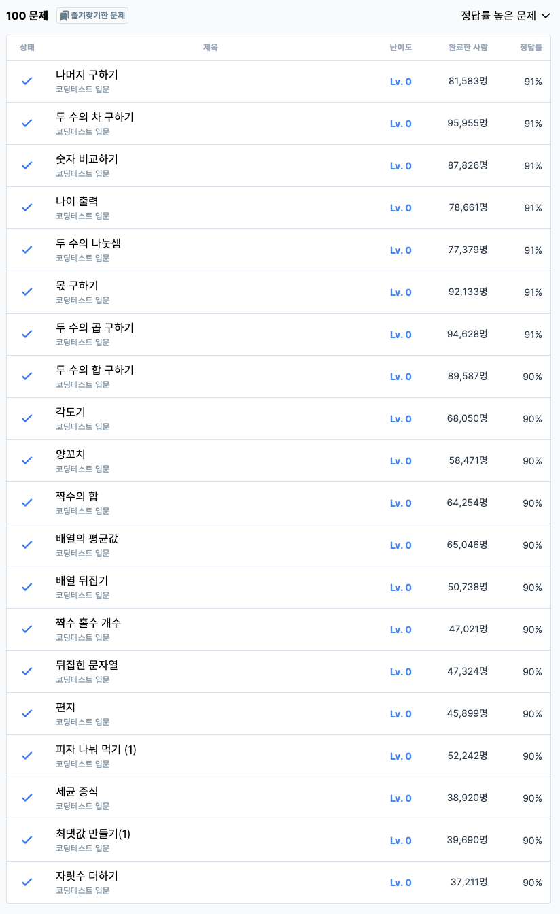

# 1주차 코딩테스트 회고

1. 어려웠던 부분/문제
    - 어려운 문제는 없었습니다.
2. 새롭게 알게 된 점
    - Math.trunc() : 소수점 이하 버리기
    
    ```jsx
    // Math.trunc()와 Math.floor() 비교
    console.log(Math.trunc(-23.3)); // -23, 소수점 이하 버리기
    console.log(Math.floor(-23.3)); // -24, 소수점 내림
    ```
    
    - Math.ceil() : 반올림
    - String도 length 프로퍼티 사용 가능
3. 궁금한 점
    - 없습니다.
4. 풀면서 느낀점
    - 아직 메소드의 return 타입을 정확히 알지 못한다는 것을 알았습니다. 문제를 풀때는 공식문서를 확인하면서 메소드들을 활용해야겠습니다.
    - 타입이 유연하다는게 역시 장점이자 단점이라고 느꼈습니다.
    - 배열 문제에서 sort() 를 바로 떠올리지 못했습니다…다음번에 비슷한 문제를 해결할때는 sort()를 이용해서 좀더 경제적으로 해결하겠습니다.
5. 문제 풀이 인증 (풀이 완료화면 스크린샷)
    
    