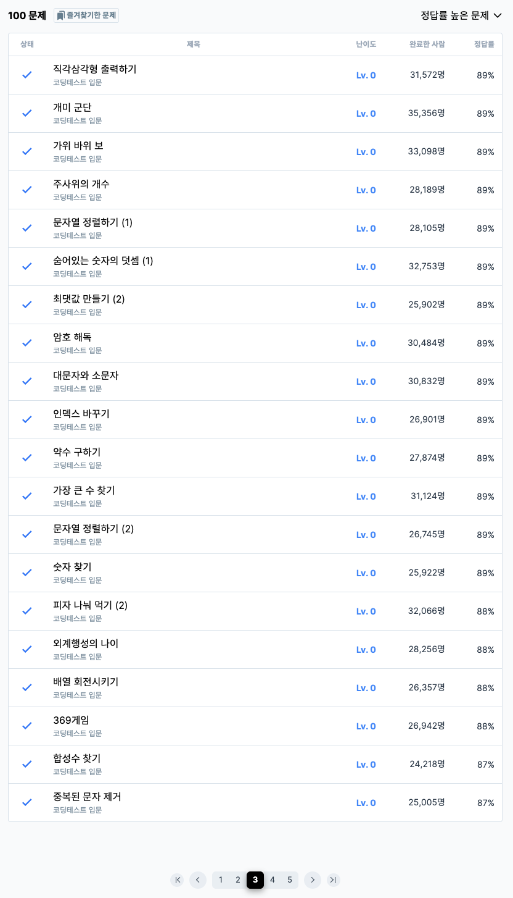

# 3주차 코딩테스트 회고

1. 어려웠던 부분/문제
    - 중복된 문자제거 풀이할때 처음에 Set()을 생각하지 못해서 헤맸음 
        -> Set 없는 풀이법은 지피티한테 물어봤습니다. [해당풀이](./solution/중복된문자제거.js)

2. 새롭게 알게 된 점
    - arr.indexOf(element) : 배열 요소의 index를 반환해주는 메소드, 없다면 -1 을 반환한다. [해당풀이](./solution/숫자찾기.js)
    - 문자열 자체도 인덱스로 접근이 가능하다. 신기한 js.. [해당풀이](./solution/외계행성의나이.js)
    - JS에는 char 자료형이 없고 모두 String 형태라서 아스키코드 <-> 문자 는 무조건 메소드를 사용해야한다. [해당풀이](./solution/외계행성의나이.js)
        - 문자 -> 아스키코드 : str.charCodeAt(index)
        - 아스키코드 -> 문자 : String.fromCharCode(num)
    - map vs for문 : 시간복잡도는 동일하고 공간복잡도는 차이가 난다지만 for문을 통해서 배열을 만들면 동일한 공간복잡도를 가지기때문에 별 차이는 없다.
        - map 특징 : 무조건 배열로 return 하기 때문에 공간 복잡도는 O(n)을 가진다. 가독성이 좋다. 
        - for문 특징 : 개발자가 반복문을 제어하는데 유리하다. 복잡한 로직이나 반복문이 중간에 중단해야하는 경우에 유리하다. 그러나 가독성이 떨어진다.  

| 구분        | 시간복잡도 | 공간복잡도 |
| --------- | ----- | ----- |
| **for문**  | O(n)  | O(1)  |
| **map()** | O(n)  | O(n)  |

3. 궁금한 점
    - 아직은 없습니다.

4. 풀면서 느낀점
    - 구조분해가 정말 많이 이용된다는 것을 느꼈습니다. 구조분해를 확실히 이해하면 많은 곳에 쓸 수 있다고 생각합니다. 
    - 배열 반복 메소드와 for문 사이에서 어느쪽이 더 좋은 방법인가에 대해서는 고민을 해봐야할 것 같습니다.

5. 문제 풀이 인증 (풀이 완료화면 스크린샷)
    
    
