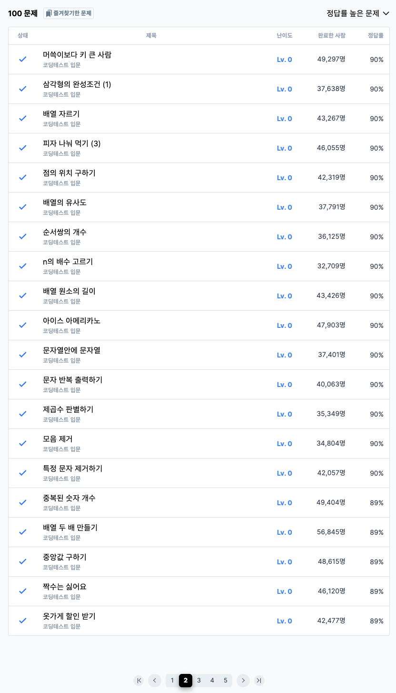

# 2주차 코딩테스트 회고

1. 어려웠던 부분/문제
    - 중간값 구하는 문제가 어려웠습니다. 

2. 새롭게 알게 된 점
    - array.includes() : 배열(문자열)의 항목에 특정 값이 포함되어있는지 판단해서 true나 false를 반환한다. 
    - sort()는 문자열 기준이라 숫자 정렬을 원하면 ((a, b) => a - b)를 써야 한다.
    - 정규표현식

| 구성 요소     | 의미                                                                    |
| --------- | --------------------------------------------------------------------- |
| `/.../`   | 정규표현식 리터럴 문법                                                          |
| `[aeiou]` | **문자 클래스 (Character Class)** → **a, e, i, o, u 중 하나**에 해당하는 문자와 일치 |
| `g`       | **global 플래그** → 문자열 내 **모든 일치 항목**을 찾음 (없으면 첫 번째 하나만 처리됨)     |

3. 궁금한 점
    - 없습니다.

4. 풀면서 느낀점
    - sort()를 사용했으나 정확한 사용법을 몰라서 헤맸습니다. 이번에는 확실한 사용법을 알 수 있었습니다.
    - 반복문 사용이 많아 다양한 배열 메소드를 사용해보았습니다. 종류가 많은 만큼 적절한 위치에 사용해야겠다고 느꼈습니다.

5. 문제 풀이 인증 (풀이 완료화면 스크린샷)
    
    
