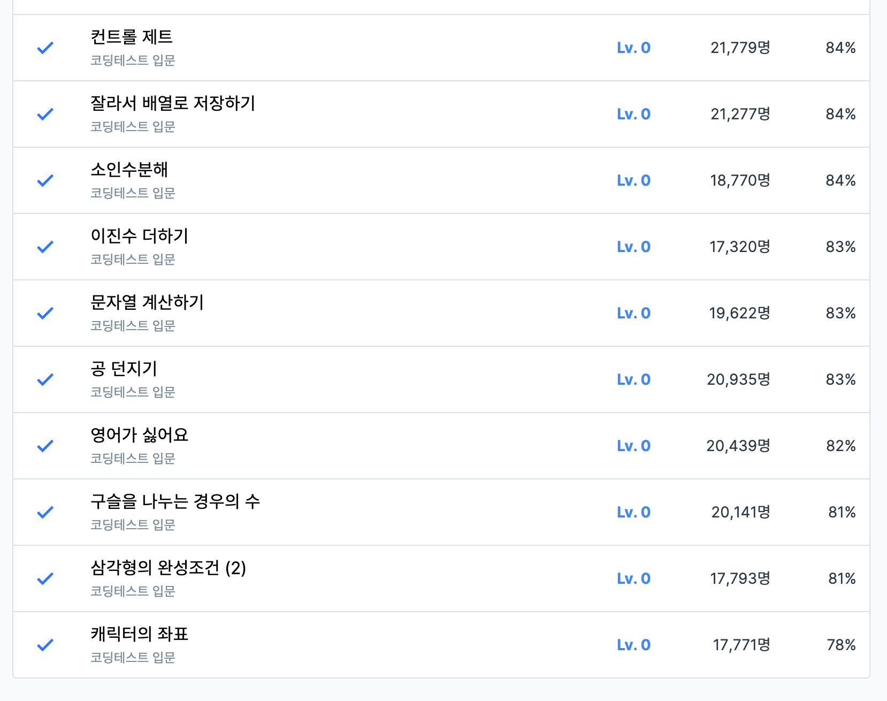

# 5주차 코딩테스트 회고

1. 어려웠던 부분/문제
    - 대부분...

2. 새롭게 알게 된 점
    - parseInt(string, 2) : string: 변환할 문자열, 2: 2진법 [해당풀이](./solution/이진수더하기.js)
    - BigInt("0b" + string) : (큰 수의 경우) "0b" : 2진법, string: 변환할 문자열

3. 궁금한 점
    - 없습니다!

4. 풀면서 느낀점
    - replace() / replaceAll()처럼 하나만 검색하거나 바꾸는 것 말고 전체를 변경하는 메소드들이 많으니 메소드를 찾을 때 좀 더 열심히 찾아보기.
    - 잊어버린 수학공식의 기억을 떠올려내야한다... [경우의수](./solution/구슬을나누는경우의수.js) [삼각형](./solution/삼각형의완성조건.js)

5. 문제 풀이 인증 (풀이 완료화면 스크린샷)
    
    
