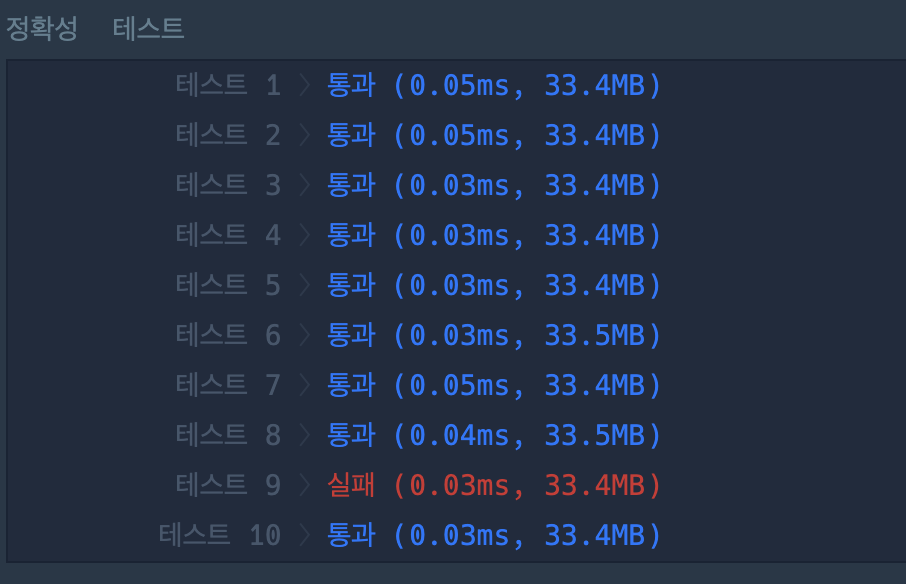
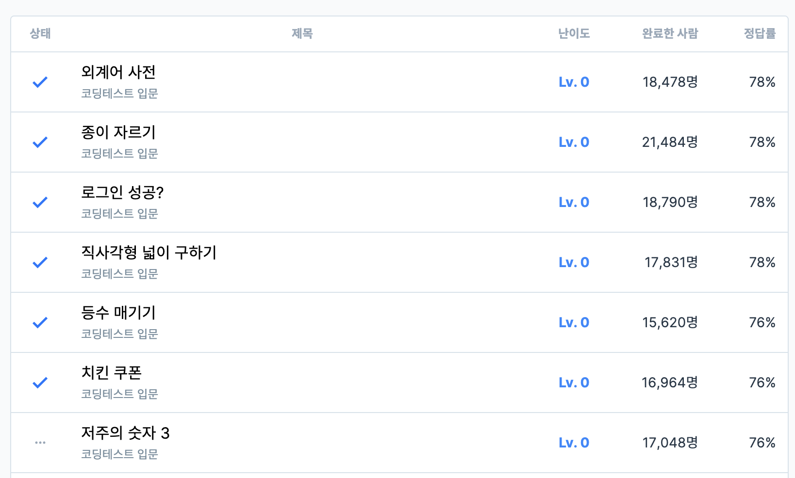

# 6주차 코딩테스트 회고

1. 어려웠던 부분/문제
    - 외계어 사전 : 주어진 테스트는 통과 했으나 테스트 중에 실패가 뜸. 결국 이유를 몰라서 지피티한테 물어봤는데 그냥 문제를 잘못 이해하고 있었다는걸 깨달았음. spell에 담긴 알파벳을 **한번씩만** **모두** 사용한 단어가 dic에 **존재**
    - 치킨 쿠폰: 어떻게 계산을 해서 로직을 완성했으나 하나가 막히는 바람에 지피티의 조언을 받았습니다... 나머지 쿠폰을 내다버린 죄가 큽니다(다들 지피티한테 물었는지 지피티가 바로 "오 👍 이번 건 “치킨 쿠폰 문제(프로그래머스 120884)” 얘기군요." 라면서 아는척합니다)
    
    - 저주의 숫자3(정말로...)

2. 새롭게 알게 된 점
    - 저주의 숫자 3 : 3의 배수가 없는 배열 생성 후(주어진 수의 3배 크기) string 변환해서 3이 include 안되는 것들만 반환한 배열의 index 반환 
    - 

3. 궁금한 점
    - 

4. 풀면서 느낀점
    - 해결 아이디어를 떠올리기가 점점 어려워집니다...
    - 

5. 문제 풀이 인증 (풀이 완료화면 스크린샷)
    
    
