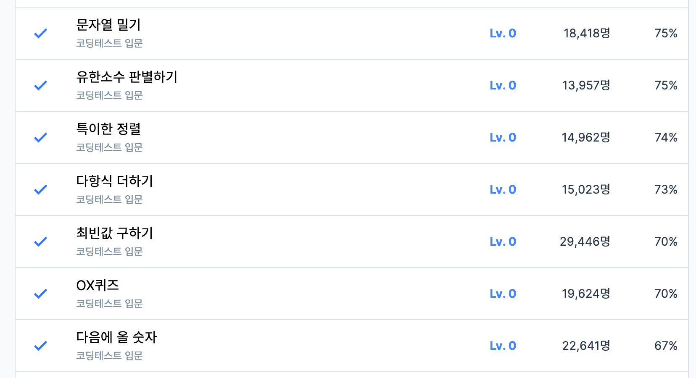

# 6주차 코딩테스트 회고

1. 어려웠던 부분/문제
    - 다항식 계산 : 다항식을 다 분해해서 x항과 상수항 계산을 시킨 후 0과 1의 경우를 분리 시키지않아 테스트 오류의 이유를 몰라서 조금 해맸음. 

2. 새롭게 알게 된 점
    - 문자열 밀기 [해당풀이](./solution/문자열밀기.js)
    - 최대 공약수를 찾는 방법 : 두 수를 나눈 나머지로 계속 나누면서 나머지가 0이 되는 수가 최대공약수이다.(유클리드호제법) [해당풀이](./solution/유한소수판별하기.js)

3. 궁금한 점
    - 

4. 풀면서 느낀점
    - 
    - 

5. 문제 풀이 인증 (풀이 완료화면 스크린샷)
    
    
